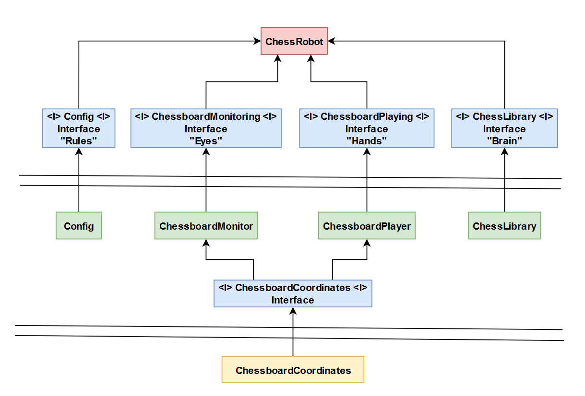

# Chess robot

Do you also like chess, and do you also hate cheaters? However, it can be beneficial to get experience with cheating techniques, at least just to spot them easily when they are being employed against you.

This project is creating a chess robot that is performing moves on a "physical screen" chessboard, as a response to opponents moves.

[See video](https://raw.githubusercontent.com/grdddj/My-codebase/master/Python/Chess%20Robot/ChessRobot_in_action.mp4)

---

## Architecture

Structure of the project tries to implement clean architecture principles described by [Clean Architecture book](https://www.amazon.com/Clean-Architecture-Craftsmans-Software-Structure/dp/0134494164) by Robert Martin. The main idea is to separate all the unique components and make them independent of each other.

It is apparent from the big amount of modules, that are all assembled together by `main.py` - using dependency injection.

All the interfaces between modules/components are defined in `api.py` - using `typing.Protocol`, which creates abstract classes for type-checking purposes.

 Users of this interface specify this class as a type of the object they want to work with. Each implementation inherits from this abstract class. Type-checker (`mypy` or `pyright`) will then statically analyze the code to see if the object being passed to the user is really compatible with the interface. Also on the implementation side, when any interface method is badly (or not) implemented, it will complain about it.

The Clean Architecture book defines __SOLID principles__. Their implementing means:
- grouping together components that change for the same reason
  - _(S)ingle Responsibility Principle_
- new plugins can be created without modifying old code
  - _(O)pen Closed Principle_
- each component can be tested independently and without knowing implementation details
  - _(L)iskov Substitution Principle_
- users depend only on what they really need
  - _(I)nterface Segregation Principle_
- components are not dependent on implementation details in other components they use
  - _(D)ependency Inversion Principle_

### Architecture diagram
